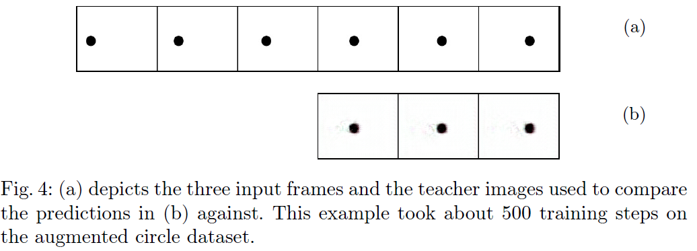

# Location-Dependent Video Ladder Network (L-VLN)

This repository contains the implementation of the L-VLN, a convolutional neural network
for supervised video prediction. The network takes in a set of three consecutive frames
and predicts the next three frames. The architecture extends on the Video Ladder Network
by incorporating location-dependent convolutions and replacing LSTM layers with more
memory-efficient GRU layers.

In addition to video prediction, we also explore transfer learning by using the hidden
states of the network for classification.

## Network Architecture

## Training and Prediction

The training and validation datasets are loaded from UCF101 videos that have been split into clips of sequences of six
frames.
Proposed training and prediction routine:

To confirm and debug the L-VLN, we first implemented a simplified model and evaluated it on a
simplified dataset, i.e. the horizontal translation of a circle as a dataset.

Despite working on the simplified dataset, the L-VLN model fails to predict movement
within the images on larger datasets like UCF101 and instead only blurs the regions containing movement.

We propose reducing the problem complexity by predicting only a single frame at a time, given a sequence of varying
length.

## Results

For more information, please refer to the full [report](seminarreport.pdf).
